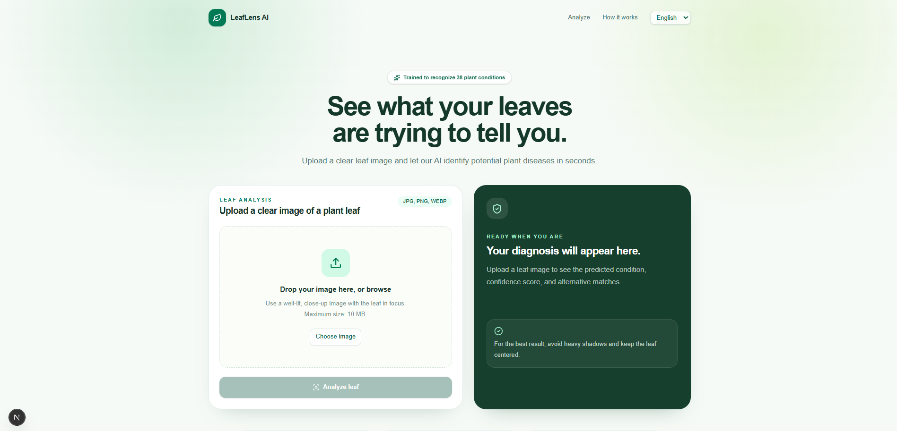

# 🌿 LeafLens AI


## 🎯 Problem Statement

Plant diseases can significantly affect crop health and agricultural productivity,
especially when symptoms are not identified at an early stage. Farmers may not
always have immediate access to agricultural experts for identifying diseases
from visible symptoms.

LeafLens AI aims to provide a fast and accessible preliminary plant-health
assessment using leaf images. By combining computer vision, leaf localization
and segmentation, and deep-learning-based disease classification, the system
helps users identify potential plant diseases and understand the recommended
care and preventive measures.

The goal is to make AI-assisted plant disease identification more accessible,
while keeping the system simple enough to be used through a web interface.


## 📌 Overview

**LeafLens AI** is an AI-powered plant health and disease detection system that analyzes leaf images using **deep learning and computer vision**.

The project combines a **Next.js frontend** with a **FastAPI machine-learning backend**. An uploaded image passes through an image localization and segmentation pipeline before being classified by an **ImageNet-pretrained EfficientNetB0** model.

The current classifier supports **38 plant disease and healthy classes** and returns the predicted condition, confidence score, and top-3 predictions.

The frontend also supports **multilingual localization**, allowing the user interface and disease information to be presented in multiple languages while keeping the ML backend language-independent and English-based.

---

## ✨ Features

### 🌿 AI Plant Disease Detection

- Image-based plant disease detection.
- EfficientNetB0-based image classification.
- 38 disease and healthy classes.
- Prediction confidence score.
- Top-3 predictions with confidence values.
- Disease-specific information including symptoms, causes, prevention, and treatment/care.

### 🎯 Image Localization & Segmentation

The image-processing pipeline includes **leaf localization and segmentation** before classification.

```text
Input Image
     ↓
Leaf Localization
     ↓
Leaf Segmentation
     ↓
Relevant Leaf Region
     ↓
Disease Classification
```

This helps reduce the influence of irrelevant background information and allows the classifier to focus on the plant leaf.

### 🖼️ Image Upload & Processing

- Drag-and-drop image upload.
- Image preview before prediction.
- Image metadata display.
- RGB image conversion.
- Image preprocessing and resizing.
- Loading and prediction states.
- Error handling.
- Reset and re-upload functionality.

### 🧠 Machine Learning Pipeline

- ImageNet-pretrained EfficientNetB0.
- Transfer learning.
- Two-stage training:
  - Feature extraction
  - Fine-tuning
- Data augmentation.
- Class weighting for class imbalance.
- Mixed-precision training.
- Early stopping.
- Learning-rate reduction.
- Best-model checkpointing.

### 🌐 Multilingual Frontend

LeafLens AI supports localized frontend content so users can interact with the application in multiple languages.

The localization layer is implemented in the **Next.js frontend**, while the **Python/FastAPI backend remains English-only**.

This separation keeps the ML inference API simple while allowing the user-facing experience to be localized independently.

Current localization includes:

- English
- Hindi
- Additional Indian languages can be added through the same localization structure.

### 🎨 Modern Frontend

- Next.js App Router.
- React 19.
- TypeScript.
- Tailwind CSS.
- Responsive desktop and mobile UI.
- Dark mode support.
- Localized interface.
- Confidence visualization.
- Centralized API integration.
- User-friendly error states.

---

## 📸 Screenshots

### 🏠 Home Page — English



### 🏠 Home Page — Hindi


### 📤 Prediction Result


### 💡 Suggestions / Disease Information


---

## 🧠 AI Pipeline

The complete application pipeline is:

```text
                    User Image
                        ↓
                 Next.js Frontend
                        ↓
               FastAPI /predict API
                        ↓
              Image Preprocessing
                        ↓
               Leaf Localization
                        ↓
               Leaf Segmentation
                        ↓
                 Relevant Leaf
                        ↓
               EfficientNetB0
                        ↓
                Global Average Pooling
                        ↓
                  Dropout (30%)
                        ↓
                 Dense Layer
                  38 Classes
                        ↓
                    Softmax
                        ↓
              Disease Probabilities
                        ↓
             Top-3 Predictions
                        ↓
             Localized Frontend
```

---

## 🔬 Model Architecture

```text
Input Image
224 × 224 × 3
      ↓
Data Augmentation
      ↓
EfficientNetB0
ImageNet Pretrained
      ↓
Global Average Pooling
      ↓
Dropout (30%)
      ↓
Dense Layer
38 Classes
      ↓
Softmax
      ↓
Disease Probabilities
```

### Training Strategy

The model is trained in two stages.

**Phase 1 — Feature Extraction**

The pretrained EfficientNetB0 backbone is frozen while the classification head learns the plant disease classes.

**Phase 2 — Fine-Tuning**

Later layers of EfficientNetB0 are unfrozen and trained with a smaller learning rate so that pretrained features can adapt to plant disease patterns.

---

## 📊 Model Output

The model returns the predicted disease, confidence, and top-3 predictions.

Example:

```json
{
  "disease": "Tomato___Early_blight",
  "confidence": 98.42,
  "top_predictions": [
    {
      "disease": "Tomato___Early_blight",
      "confidence": 98.42
    },
    {
      "disease": "Tomato___Late_blight",
      "confidence": 0.91
    },
    {
      "disease": "Tomato___Leaf_Mold",
      "confidence": 0.31
    }
  ]
}
```

---

## 🔌 API

### `POST /predict`

Accepts a plant leaf image using `multipart/form-data` and returns a structured prediction.

### Request

```text
Content-Type: multipart/form-data

file = <leaf image>
```

### Response

```json
{
  "success": true,
  "filename": "leaf.jpg",
  "disease": "Tomato___Early_blight",
  "confidence": 98.42,
  "top_predictions": [
    {
      "disease": "Tomato___Early_blight",
      "confidence": 98.42
    }
  ]
}
```

The backend API remains **English-only**. Localization is handled by the Next.js frontend.

---

## 🛠️ Tech Stack

### Frontend

- Next.js — App Router
- React 19
- TypeScript
- Tailwind CSS
- next-intl / frontend localization
- Dark mode

### Backend

- Python 3.10+
- FastAPI
- Uvicorn
- Pillow

### Machine Learning

- TensorFlow
- Keras
- EfficientNetB0
- NumPy
- Scikit-learn

### Computer Vision

- Image preprocessing
- Leaf localization
- Leaf segmentation

---

## 📂 Project Structure

```text
SIH/
│
├── backend/
│   ├── main.py
│   ├── predict.py
│   ├── train.py
│   ├── evaluate.py
│   ├── evaluate_vald.py
│   │
│   ├── models/
│   │   ├── best_plant_disease_model.keras
│   │   ├── plant_disease_model.keras
│   │   └── class_names.json
│   │
│   └── test/
│
├── frontend/
│   ├── app/
│   ├── components/
│   ├── lib/
│   ├── messages/
│   │   ├── en.json
│   │   └── hi.json
│   ├── public/
│   ├── i18n/
│   ├── .env.example
│   └── package.json
│
└── README.md
```

> The exact frontend localization folder names may vary depending on the current Next.js project structure.

---

---

## 📈 Current Prototype

The current prototype provides:

- ✅ End-to-end image upload
- ✅ Next.js frontend
- ✅ FastAPI backend
- ✅ Leaf localization
- ✅ Leaf segmentation
- ✅ EfficientNetB0 classification
- ✅ 38 disease/healthy classes
- ✅ Top-3 predictions
- ✅ Confidence scores
- ✅ Disease information
- ✅ Multilingual frontend localization
- ✅ Hindi interface
- ✅ Dark mode
- ✅ Data augmentation
- ✅ Transfer learning
- ✅ Fine-tuning
- ✅ Class weighting
- ✅ Mixed precision
- ✅ Error handling
- ✅ Responsive UI

The current validation accuracy is approximately **98.07%** on the current validation dataset.

> **Note:** Validation accuracy does not guarantee the same performance on real-world images. Complex backgrounds, unusual lighting, blur, multiple leaves, and other uncontrolled conditions can affect predictions. A high softmax confidence score also does not necessarily guarantee that a prediction is correct.

---

## ⚙️ How It Works

1. **Upload** — The user uploads an image of a plant leaf.
2. **Localization** — The relevant leaf region is identified.
3. **Segmentation** — The leaf is isolated from irrelevant background regions.
4. **Preprocessing** — The image is converted and resized for model inference.
5. **Classification** — EfficientNetB0 predicts the plant's health condition.
6. **Ranking** — The system generates the top-3 predictions and confidence scores.
7. **Presentation** — Disease information is displayed in the user's selected language.

---

## 🔮 Future Improvements

- More diverse real-world field-image training data.
- Improved leaf localization and segmentation.
- Stronger robustness-focused augmentation.
- Confidence-based image-quality feedback.
- Disease severity estimation.
- Multiple-leaf analysis.
- Plant health monitoring over time.
- Additional Indian language support.
- Mobile application.
- Edge/offline inference.
- Scalable model-serving infrastructure.

---


## 📌 Project Status

**Current Stage: Working Prototype 🚀**

LeafLens AI currently provides an end-to-end plant disease detection pipeline:

```text
Image Upload
     ↓
Next.js Frontend
     ↓
FastAPI Backend
     ↓
Image Preprocessing
     ↓
Leaf Localization
     ↓
Leaf Segmentation
     ↓
EfficientNetB0
     ↓
38-Class Prediction
     ↓
Confidence + Top-3
     ↓
Localized Disease Information
     ↓
Next.js Results UI
```

The primary focus going forward is **improving real-world robustness, strengthening the localization and segmentation pipeline, expanding multilingual accessibility, and preparing the system for scalable deployment**.

---

